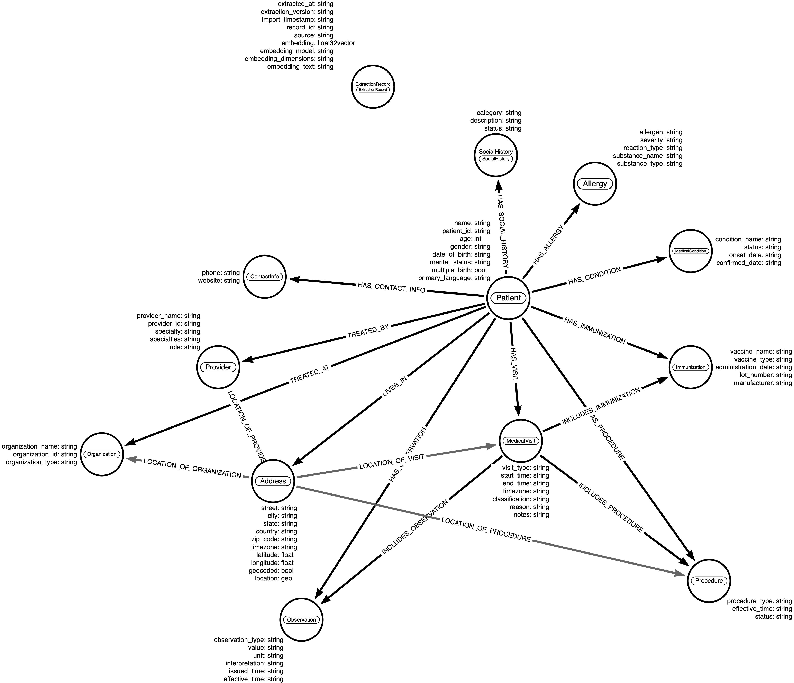

# Medical Data Extraction with BAML and DGraph Integration

This project demonstrates how to use BAML (Boundary ML) to extract structured medical data from unstructured clinical text and then import that data into DGraph for advanced graph-based querying and relationship analysis.



## Project Structure

```
baml-dgraph-patient-graph-example/
├── baml_src/
│   ├── main.baml              # BAML function definitions
│   ├── medical_models.baml    # Data models and schemas
│   └── clients.baml           # LLM client configurations
├── scripts/
│   ├── extract_medical_data.py    # BAML extraction script
│   ├── dgraph_importer.py         # DGraph import script
│   ├── sample_medical_text.py     # Sample medical text data
│   └── run_with_uv.py             # UV environment verification
├── data/                           # Data directory
│   ├── all_medical_records.json   # Combined extracted data
│   ├── extracted_sample_*.json    # Individual extraction results
│   └── flir-data.parquet          # Additional sample data
├── baml_client/                    # Generated BAML Python client
├── pyproject.toml                  # Project configuration and dependencies
├── uv.lock                         # Locked dependency versions
├── .env                            # Environment variables (create from env.example)
├── env.example                     # Environment variables template
├── setup.py                        # Automated setup script
├── test_setup.py                   # Setup verification script
├── demo_workflow.py                # Complete workflow demonstration
├── Makefile                        # Common commands
├── quick_start.sh                  # Quick setup automation
└── README.md                       # This file
```

## Features

- **Structured Medical Data Extraction**: Uses BAML with GPT-4 to extract patient information, medical visits, allergies, and provider details
- **Graph Database Integration**: Imports extracted data into DGraph with proper relationships and indexing
- **Comprehensive Schema**: Full medical data model with patient, visit, provider, allergy, and address entities
- **Sample Data**: Includes realistic medical text examples for testing
- **Environment Configuration**: Secure API key management via environment variables
- **Modern Python Tooling**: Uses uv for fast dependency management and virtual environments

## Prerequisites

- Python 3.9+
- uv package manager
- Node.js (for BAML CLI)
- DGraph instance running (local or remote)
- OpenAI API key (or Anthropic API key as alternative)

## Installation

### 1. Install uv

```bash
# Install uv package manager
curl -LsSf https://astral.sh/uv/install.sh | sh

# Or using pip
pip install uv
```

### 2. Install BAML CLI

```bash
npm install -g @boundaryml/baml
```

### 3. Clone and Setup Project

```bash
# Navigate to project directory
cd baml-dgraph-patient-graph-example

# Install dependencies and create virtual environment
uv sync

# Copy environment template
cp env.example .env

# Edit .env with your API keys and DGraph connection
# DGRAPH_CONNECTION_STRING=dgraph://your-dgraph-host:9080
```

### Quick Start (Automated)

For a fully automated setup, use the provided script:

```bash
# Make the script executable and run it
chmod +x quick_start.sh
./quick_start.sh
```

This script will:
- Check for required tools (uv, baml-cli)
- Install them if missing
- Set up the project environment
- Generate BAML client
- Create .env file
- Run setup verification

### 4. Initialize BAML Project

```bash
# Initialize BAML project
baml-cli init

# Generate Python client
baml-cli generate
```

## Configuration

### Environment Variables

Create a `.env` file with the following variables:

```bash
# OpenAI API Key for BAML
OPENAI_API_KEY=your_openai_api_key_here

# Anthropic API Key (alternative)
ANTHROPIC_API_KEY=your_anthropic_api_key_here

# DGraph Configuration
DGRAPH_CONNECTION_STRING=dgraph://localhost:9080
```

### DGraph Connection

The system supports the `dgraph://` connection string format:
- `dgraph://localhost:9080` - Local DGraph instance
- `dgraph://your-dgraph-host.com:9080` - Remote DGraph instance
- `localhost:9080` - Direct host:port format (fallback)

## Usage

### 1. Start DGraph (if not running)

```bash
# Using Docker
docker run -it -p 8080:8080 -p 9080:9080 dgraph/standalone:latest

# Or connect to existing DGraph instance
```

### 2. Extract Medical Data

```bash
# Run BAML extraction on sample texts
uv run python scripts/extract_medical_data.py
```

This will:
- Process sample medical texts using BAML
- Extract structured data (patient info, visits, allergies, etc.)
- Save results to JSON files
- Create `all_medical_records.json` for DGraph import

### 3. Import to DGraph

```bash
# Import extracted data into DGraph
uv run python scripts/dgraph_importer.py
```

This will:
- Setup DGraph schema for medical data
- Import all extracted records
- Create relationships between entities
- Run test queries to verify import

### 4. Run Complete Demo Workflow

```bash
# Run the complete end-to-end demonstration
uv run python demo_workflow.py
```

This demonstrates the full pipeline:
- BAML extraction from medical text
- DGraph import with schema setup
- Data querying and verification

## Data Organization

The project organizes data files in a dedicated `data/` directory:

- **`data/all_medical_records.json`**: Combined extracted data for DGraph import
- **`data/extracted_sample_*.json`**: Individual extraction results
- **`data/flir-data.parquet`**: Additional sample data files

This organization keeps the root directory clean and separates code from data files.

##  Sample Notes Input

```text
	
### Instruction:
Patient Information:

Mr. Colton Tracey McCullough, a male, born on the 5th of December, 1967, is an English (United States) speaking individual.

Clinical Encounter:

Drawing back to his medical history, Mr. McCullough had an eventful medical encounter on the 6th of November, 2018. The encounter took place at Fitchburg Outpatient Clinic, from 3:28:31 AM to 4:28:31 AM, Central European Time. Dr. Ted Reilly took the responsibility to manage and guide him through this medical encounter, where Mr. McCullough was identified as his prominent patient. The purpose of this encounter was to address prevailing health issues; primary among them was chronic congestive heart failure. This ambitious act marked a significant point in his diagnosis.

The Outpatient Clinic:

The encounter occurred at the esteemed medical institute, Fitchburg Outpatient Clinic, located at 881 Main Street, Fitchburg, MA 01420, United States of America. Being a sturdy pillar in the healthcare field, the Clinic serves as a highly respected healthcare provider in the community.

Medical Procedure:

Adding to his long medical chronicle, Mr. McCullough underwent a medical procedure on the same day of his encounter. This meticulous procedure, which was successfully completed, comprehensibly transpired from 3:28:31 AM to 03:43:31 AM, Central European Time.
It's noteworthy that these aforementioned details cohesively form the medical history of Mr. McCullough in concordance with his clinical journey at the Fitchburg Outpatient Clinic.
```

## Sample Output

The system extracts structured data like:

```json
{
  "patient": {
    "name": "Mr. Fernando Amos Breitenberg",
    "marital_status": "married"
  },
  "visits": [{
    "visit_type": "well child visit",
    "start_time": "December 23, 1992, at 01:08:42",
    "end_time": "01:23:42",
    "timezone": "+01:00",
    "provider": {
      "name": "Dr. Trent Krajcik"
    }
  }],
  "allergies": [{
    "allergen": "shellfish",
    "confirmed_date": "April 2, 1994, at 12:08:42"
  }]
}
```

## DGraph Schema

The system creates a comprehensive graph schema with:

- **Patient nodes**: Core patient information
- **Medical Visit nodes**: Visit details with timestamps
- **Provider nodes**: Healthcare provider information
- **Allergy nodes**: Patient allergy records
- **Address nodes**: Facility and provider locations
- **Extraction Record nodes**: Metadata about data extraction

All entities are properly linked with bidirectional relationships for efficient querying.

## Querying Data

After import, you can query the graph using DGraph's GraphQL+ syntax:

```graphql
{
  patient(func: eq(name, "Mr. Fernando Amos Breitenberg")) {
    name
    has_visit {
      visit_type
      start_time
      conducted_by {
        name
      }
    }
    has_allergy {
      allergen
      severity
    }
  }
}
```

## Development

### Using uv Commands

```bash
# Install dependencies
uv sync

# Install development dependencies
uv sync --extra dev

# Add new dependency
uv add package_name

# Add development dependency
uv add --dev package_name

# Remove dependency
uv remove package_name

# Run Python script in virtual environment
uv run python script.py

# Activate virtual environment
source .venv/bin/activate
```

### Using Make Commands

```bash
# Show all available commands
make help

# Install dependencies
make install

# Install development dependencies
make install-dev

# Run tests
make test

# Run complete pipeline
make pipeline

# Clean up
make clean
```

The `clean` target removes generated files from both the root directory and the `data/` directory.

## Customization

### Adding New Medical Text

1. Add your medical text to `scripts/sample_medical_text.py`
2. Update the `samples` list in `extract_medical_data.py`
3. Run the extraction script

### Modifying Data Models

1. Update `baml_src/medical_models.baml` with new fields
2. Regenerate BAML client: `baml-cli generate`
3. Update DGraph schema in `dgraph_importer.py`
4. Re-run the pipeline

### Using Different LLMs

Modify `baml_src/clients.baml` to use different models or providers.

## Troubleshooting

### Common Issues

1. **BAML Client Not Found**: Run `baml-cli generate` after setup
2. **DGraph Connection Failed**: Check your connection string and ensure DGraph is running
3. **API Key Errors**: Verify your `.env` file has correct API keys
4. **Schema Errors**: DGraph schema setup warnings are usually safe to ignore
5. **uv Not Found**: Install uv with `curl -LsSf https://astral.sh/uv/install.sh | sh`

### Debug Mode

Enable verbose logging by setting environment variables:
```bash
export PYTHONPATH="${PYTHONPATH}:$(pwd)"
export BAML_LOG_LEVEL=DEBUG
```

## Contributing

1. Fork the repository
2. Create a feature branch
3. Make your changes
4. Test with sample data
5. Submit a pull request

## License

This project is licensed under the MIT License - see the LICENSE file for details.

## Support

For issues related to:
- **BAML**: Check [BAML documentation](https://docs.boundaryml.com/)
- **DGraph**: Check [DGraph documentation](https://dgraph.io/docs/)
- **uv**: Check [uv documentation](https://docs.astral.sh/uv/)
- **This Project**: Open an issue in the repository

## Graph RAG Enabled Medical Analysis Sample Topics

### Age and Visit Patterns:

- What is the age distribution of patients and how does it correlate with visit frequency?
- Do older patients have more medical visits or different types of visits?
- What's the average time between visits for patients with multiple encounters?

### Gender-Based Healthcare Utilization:

- Are there differences in visit types between male and female patients?
- Do certain medical procedures or assessments show gender-based patterns?

### Allergy Management & Safety
#### Allergy Severity Analysis:

- What's the distribution of allergy severities across the patient population?
- Which allergens are associated with the most severe reactions?
- How many patients have multiple allergies, and what are common combinations?

#### Allergy Documentation Quality:

- Which allergy records have complete documentation (confirmed dates, severity, reaction types)?
- Are there gaps in allergy documentation that could impact patient safety?

### Visit Analysis & Care Coordination
#### Visit Type Patterns:

- What are the most common types of medical visits?
- Which patients have the most diverse visit types (indicating complex care needs)?
- Are there seasonal patterns in immunizations or other visit types?

#### Care Continuity:

- Which patients have had visits spanning multiple years?
- Are there patients with gaps in care that might need follow-up?
- What's the typical duration of medical visits by type?

### Temporal Healthcare Trends
#### Historical Care Patterns:

- How has the frequency of different visit types changed over time?
- Are there patients with very old allergy confirmations that might need updating?
- What's the timeline of care for patients with multiple visits?

### Data Quality & Completeness
#### Missing Information Analysis:

- Which patients lack complete demographic information?
- How many patients have visits but no associated provider information?
- Are there patients missing critical allergy or contact information?

### Geographic Healthcare Access
#### Location-Based Care:

- Are patients clustered around certain medical facilities?
- What's the geographic distribution of different visit types?
- Are there areas with limited healthcare access based on patient addresses?

### Risk Stratification
#### High-Risk Patient Identification:

- Which patients have multiple severe allergies that require special monitoring?
- Are there patients with concerning gaps between visits who might need outreach?
- Which patients have complex medical histories (multiple visit types + allergies)?

### Sample Queries You Could Run:

- **"Find patients with multiple severe allergies and their most recent visit"**
- **"Identify patients who haven't had visits in over 2 years"**
- **"Analyze the relationship between patient age and number of allergies"**
- **"Find all immunization visits and check if patients have documented allergies"**
- **"Identify patients with incomplete allergy documentation"**
- **"Find patients with the most complex care patterns (multiple visit types)"**

### Clinical Decision Support Questions:

- Are there patients with shellfish allergies who had visits but no allergy warnings documented?
- Which patients might benefit from allergy testing based on their visit patterns?
- Are there medication-related visits for patients with drug allergies?